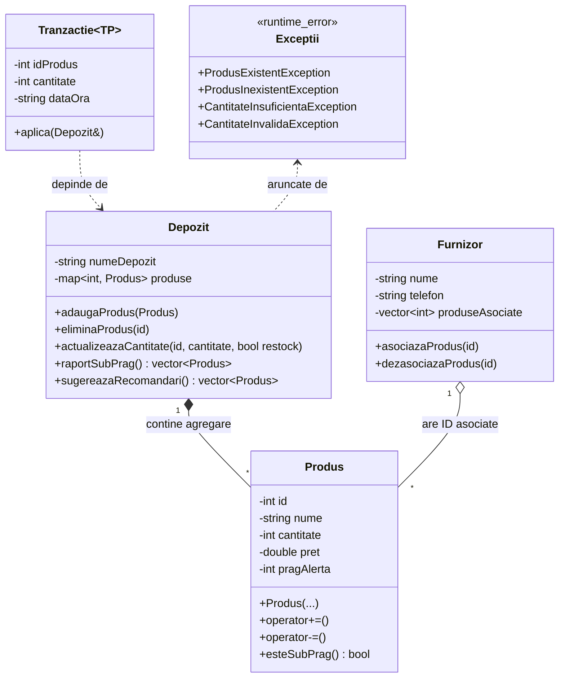

# Documentatie Proiect POO

**Autor:** Proiect C++
**Subiect:** Sistem de Monitorizare a Stocurilor unui Depozit

--

## 1. Structura Claselor si Diagrama UML

Implementarea proiectului utilizeaza un nivel adecvat de separare a responsabilitatilor (SRP) si agregare intre clase.

## 2. Concepte POO Utilizate

- **Incapsulare:** Datele membre (`id`, `nume`, `cantitate` etc.) sunt private (`private`), accesul si modificarea fiind realizate prin intermediul getterilor, setterilor validati si operatorilor publici.
- **Supraincarcarea (Overloading):**
  - Au fost supraincarcati operatorii `+=` pentru adaugarea unei cantitati la stocul curent.
  - S-a supraincarcat `-=` pentru scaderea din stoc (vanzare).
  - Operatorul `<<` (friend function) a fost supraincarcat pentru `Produs`, `Depozit`, `Tranzactie` si `Furnizor` pentru o afisare intuitiva si usor de formatat in `std::cout`.
- **Structuri Dinamice (STL Containers):** 
  - Clasa `Depozit` utilizeaza `std::map<int, Produs>` pentru garantarea unicitatii ID-ului si cautare performanta.
  - S-au folosit de asemenea `std::vector` pentru rapoarte, sortare, si asocierile din clasa `Furnizor`.
- **Gestionarea Exceptiilor:** Orice eroare semantica (ex. un produs care exista deja la adaugare, un sold de produse insuficient la o vanzare) asaza executia pe o cale sigura printr-un mecanism `throw / catch`. Exceptiile custom mostenesc `std::runtime_error`.
- **Genericitate / Template-uri:** Clasa `Tranzactie<TP>` depinde de un tip generic (un tag-struct `Intrare` sau `Iesire`). Prin _explicit template specialization_ metoda `aplica(depozit)` se comporta diferit (aduna sau scade cantitatea) in functie de tipul de structura ales in compilare.
- **Agregare:** Depozitul are o colectie de tip mapa de `Produs`e – ciclul de viata este gestionat acolo. Un `Furnizor` are de asemenea un vector de ID-uri care conecteaza furnizorii de diverse elemente din array logic.

## 3. Posibile Imbunatatiri pe Viitor
- Utilizarea unor baze de date reale in locul hardcodarilor in memorie tip `map`.
- Persistenta fisierelor (citire din si salvare catre fisiere .csv sau .json, cu parsare speciala).
- Adaugarea conceptului de Istoric Tranzactii (un sir logic cu un pointer catre un `std::list` sau `std::deque`) in insusi Depozit.
- Sistem de multi-threading (in cazul adaugarii unor request-uri multiple de vanzare simultan, lock-uri pe `std::mutex`).
